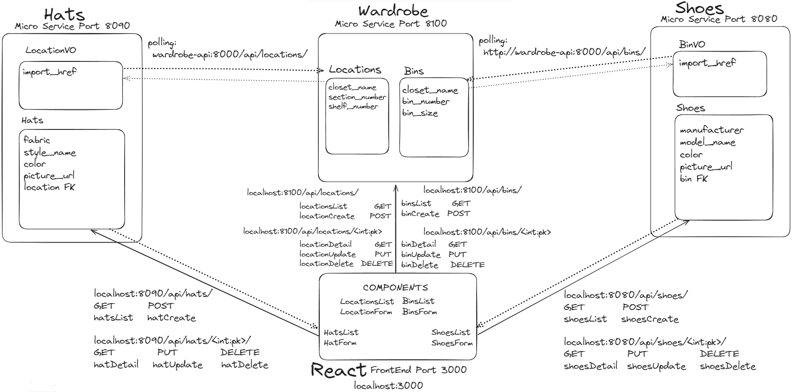
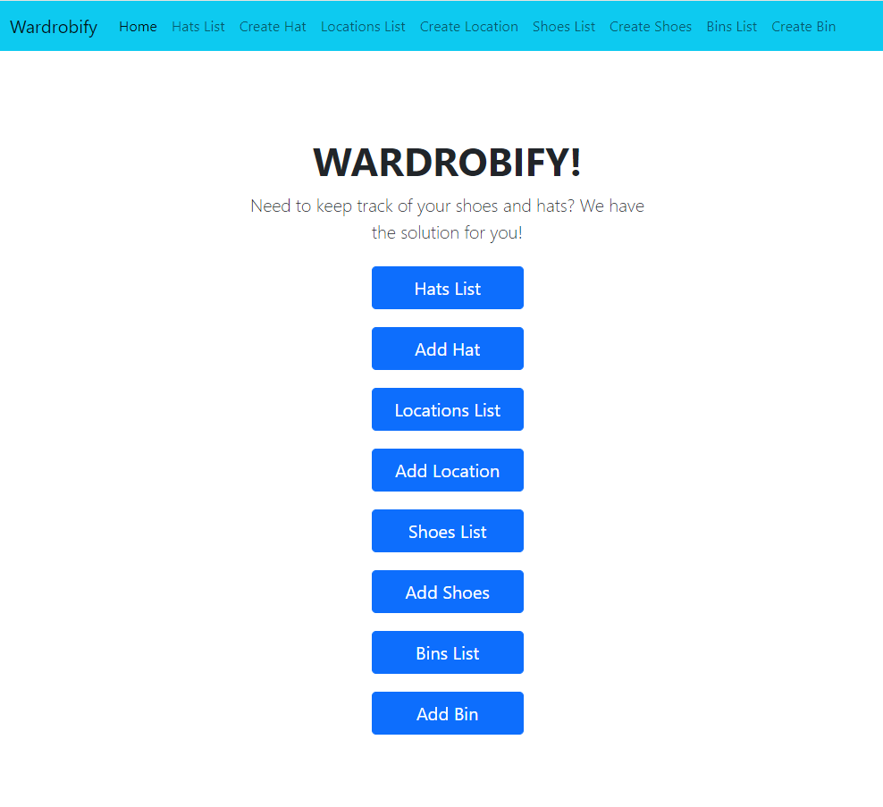

# Open Closet

Team:

* Glenn Padilla - Shoes
* Andrew Yi - Hats

## Diagram

## Design
Hello! Welcome to Open Closet, a scalable web application that allows people with large and/or many closets to organizations involved in the shoes and hats industry to organize their hats and shoes by specified locations for hats and specified bins for shoes! Please take a look through this README documentation before starting.

Getting Started:
    To get the application up and running, use the terminal to fork and clone the open-closet directory at https://github.com/glennpadilla/open-closet.
    Once complete, please run the commands in order to create the project's volumes to point to our appropriate code directories for data to persist while developing, network for internal and external communication via polling, RESTful API, URL pathing, and database configuration, and necessary microservices environments via Docker containers:

    1. docker volume create two-shot-pgdata
    2. docker-compose build
    3. docker-compose up

    Note: For macOS users, you can safely ignore any warnings about an environment variable named OS being missing.

The Wardrobe, Shoes, and Hats MicroServices all run on internal port 8000 for polling data

The main wardrobe application runs on external port 8100 for Restful API data transfer     ***API DOCUMENTATION BELOW FOR ALL MICROSERVICES BELOW***

The Shoes microservice runs on external port 8080 for Restful API data transfer

The Hats microservice runs on external port 8090 for Restful API data transfer

The Wardrobify React Front End main page running on port 3000 can be accessed in a browser using the following url:   *** http://localhost:3000/ ***

## Hats microservice

The hats microservice has two models: Hats and LocationVO

Hats:
    Hats model has attributes: fabric, style, color, picture_url, and location which is a foreign key to the LocationVO model that we created by polling wardobe microservice for the Location model data.

LocationVO:
    The LocationVO model polls the wardrobe-api on port 8000 to obtain href values from the Location model data to create LocationVO replica objects with the import_href attribute that will be used by the API views functions and the front end React service to get the appropriate Location details that the hats are stored in.

## Shoes microservice

The shoes microservice has two models: Shoes and BinVO

Shoes:
    The shoes model has the following defined fields: manufacturer, model_name, color, picture_url, and bin. The bin Foreign Key in the shoes model is a Foreign Key to the BinVO model.

BinVO:
    The BinVO model polls from the wardrobe API to obtain href values and a constructed bin name to be used by the view functions in the shoes API and the front end React service to get the appropriate Bin details that the shoes are stored in.

### API DOCUMENTATION

*** Get, Create, Update, Delete, and View Data via Internet Browser & Insomnia:  use the following API URLs and Instructions ***

# HATS          replace **'id'** with the id number of a specific hat

| Action | Method | URL
| ----------- | ----------- | ----------- |
| List hats | GET | http://localhost:8090/api/hats/
| *Create a hat | POST | http://localhost:8090/api/hats/ |
| Get a specific hat | GET | http://localhost:8090/api/hats/id/
| *Update a specific hat | PUT | http://localhost:8090/api/hats/id/
| Delete a specific hat | DELETE | http://localhost:8090/api/hats/id/

# Creating and Updating a hat requires hat details sent as JSON body

*** replace example JSON body with your hat details: for example, replace "green" with "red" if your hat is red ***
*** updates only require attributes you are updating: for example, while creating requires the format below, updating you can just leave the line "color": "green" in the JSON body and it will update the existing hat details to reflect the change in color  ***

JSON body format:

{
    "fabric": "cloth",
    "style": "baseball",
    "color": "green",
    "picture_url": "https://i5.walmartimages.com/seo/Top-Headwear-Baseball-Cap-Hat-Kelly-Green_1bdea906-6818-446b-afb3-8fac81abfd12_1.7a4983bdef8f661b72b805dadc383940.jpeg?odnHeight=640&odnWidth=640&odnBg=FFFFFF",
    "location_href": "/api/locations/1/"
}

*** location_href above references the specific location the hat is stored in, see below (Get a specific location) ***
*** the 1 in "/api/locations/1/" represents the **'id'** of the specific location used below in the API URLs for locations ***

# LOCATIONS         replace **'id'** with the id number of a specific location

| Action | Method | URL
| ----------- | ----------- | ----------- |
| List locations | GET | http://localhost:8100/api/locations/
| *Create a location | POST | http://localhost:8100/api/locations/ |
| Get a specific location | GET | http://localhost:8100/api/locations/id/
| *Update a specific location | PUT | http://localhost:8100/api/locations/id/
| Delete a specific location | DELETE | http://localhost:8100/api/locations/id/

#Creating and Updating a location requires location details sent as JSON body

*** replace example JSON body with your location details, updates only require attributes you are updating ***

JSON body format:

{
	"closet_name": "A",
	"section_number": 1,
	"shelf_number": 1
}

# SHOES         replace **'id'** with the id number of specific shoes

| Action | Method | URL
| ----------- | ----------- | ----------- |
| List shoes | GET | http://localhost:8080/api/shoes/
| *Create shoes | POST | http://localhost:8080/api/shoes/ |
| Get specific shoes | GET | http://localhost:8080/api/shoes/id/
| *Update specific shoes | PUT | http://localhost:8080/api/shoes/id/
| Delete specific shoes | DELETE | http://localhost:8080/api/shoes/id/

#Creating and Updating shoes requires shoes data sent as JSON body

*** replace example JSON body with your location details, updates only require attributes you are updating ***

JSON body format:

{
    "manufacturer": "Timberland",
    "model_name": "Boots",
    "color": "brown",
    "picture_url": "https://m.media-amazon.com/images/I/81LbDKtUgmL._AC_SY500_.jpg",
    "bin": "/api/bins/1/"
}

*** bin above references the specific location the shoes are stored in, see below (Get a specific bin) ***

# BINS          replace **'id'** with the id number of a specific bin

| Action | Method | URL
| ----------- | ----------- | ----------- |
| List bins | GET | http://localhost:8100/api/bins/
| *Create a bin | POST | http://localhost:8100/api/bins/ |
| Get a specific bin | GET | http://localhost:8100/api/bins/id/
| *Update a specific bin | PUT | http://localhost:8100/api/bins/id/
| Delete a specific bin | DELETE | http://localhost:8100/api/bins/id/

#Creating and Updating a bin requires bin details sent as JSON body

*** replace example JSON body with your bin details, updates only require attributes you are updating ***

JSON body format:

{
	"closet_name": "A",
	"bin_number": 1,
	"bin_size": 1
}

# REACT FRONT END SINGLE PAGE APPLICATION (Port 3000) *** USE INTERNET BROWSER AT http://localhost:3000/ ***

Now that you have seen how the data is managed via the DJANGO PYTHON BACK END MICRO SERVICES SERVERS!

It is time to interact with the SINGLE PAGE APPLICATION to VIEW and MANAGE/ORGANIZE your HATS, SHOES, LOCATIONS, and BINS, all through ONE PAGE created via REACT JAVASCRIPT!

HOME PAGE:

[Homepage Image](wardrobify_app.png)

[Hats List page Image](hatsList.PNG)

[Create Hat page Image](hatsForm.PNG)

[Locations List page Image](locationsList.PNG)

[Create Location page Image](locationsForm.PNG)

[Shoes List page Image]

[Create Shoes page Image](shoesForm.PNG)

[Bins List page Image]

[Create Bin page Image](binsForm.PNG)

Browser URL: http://localhost:3000/

*** User Friendly Website! Easy navigation! Explore and organize your hats in locations and shoes in bins! ***
